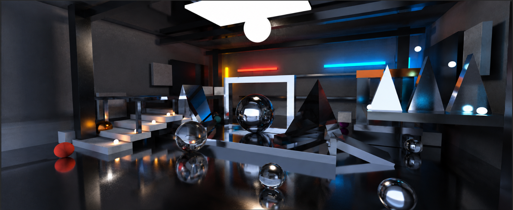

# AetherTrace — Advanced CUDA GPU Path Tracer

<p align="center">

  

  

  

  

  

</p>

<p align="center">

  <b>A from-scratch CUDA path tracer implementing Monte Carlo light transport, physically based materials, importance sampling, BVH acceleration, custom geometry, and GPU-oriented optimizations.</b>

</p>

## Preview

<p align="center">

  

</p>

<p align="center">

  <em>Industrial sci-fi atrium rendered with CUDA path tracing, reflective metals, dielectric geometry, emissive lighting, importance sampling, and BVH acceleration.</em>

</p>

---

## Overview

This project is a **GPU-accelerated path tracer written from scratch in C++ and NVIDIA CUDA**.

It began with basic ray tracing and evolved into a rendering system covering both **physically based rendering** and **GPU systems programming**.

The renderer includes:

- Monte Carlo path tracing
- CUDA GPU parallel rendering
- BVH + AABB acceleration
- Lambertian cosine-weighted sampling
- Multiple spherical-light sampling
- Mixture PDFs
- Next Event Estimation (NEE)
- GGX / Cook-Torrance metallic BRDF
- Fresnel reflection and refraction
- Dielectric / glass materials
- Emissive materials
- Russian roulette termination
- Custom triangles and triangular prisms
- Rotated geometry
- Persistent CURAND states
- GPU-side scene construction
- Batched sample accumulation
- CUDA event-based GPU timing
- GPU-oriented traversal/cache optimizations

The final showcase is a deliberately built **industrial / sci-fi atrium** rather than an introductory random-sphere scene.

---

## CPU vs CUDA Version

The CPU ray tracer focuses mainly on rendering algorithms, materials, sampling, and image quality.

The CUDA version keeps those foundations and adds a second engineering layer:

```text
CPU Ray Tracer
      |
      +--> Rendering algorithms
      +--> Materials
      +--> Sampling
      +--> Image quality
CUDA Ray Tracer
      |
      +--> Rendering algorithms
      +--> Materials
      +--> Sampling
      |
      +--> GPU parallelism
      +--> Memory behavior
      +--> BVH acceleration
      +--> CUDA execution
      +--> Kernel optimization
```

---

## Features

| Feature | Description |
|---|---|
| 🎯 Monte Carlo Path Tracing | Multi-sample stochastic multi-bounce light transport. |
| ⚡ CUDA Rendering | Pixels are mapped to CUDA threads for GPU-parallel rendering. |
| 🌳 BVH | Hierarchical scene traversal that rejects large groups of primitives. |
| 📦 AABB | Slab-based bounding-box intersection for BVH nodes. |
| 🌤️ Lambertian | Cosine-weighted diffuse importance sampling. |
| 💡 Multiple Lights | Six visible emitters plus ten illumination-only area-light samples. |
| 📐 Diffuse Sampling | Cosine-weighted path continuation. |
| 🔦 NEE | Power-weighted direct estimation with shadow rays on diffuse and glossy surfaces. |
| ✨ GGX / Cook-Torrance | Microfacet metallic BRDF with Fresnel and Smith masking. |
| 💎 Dielectric | Reflection, refraction, Fresnel, and total internal reflection. |
| 🔆 Emission | Emissive materials and visible architectural light accents. |
| 🎲 Russian Roulette | Probabilistic termination of low-contribution paths. |
| 🔺 Custom Geometry | Triangles, triangular prisms, and rotated objects. |
| 🧹 Floor Denoising | Edge-aware output filtering reduces path noise on the reflective foreground floor. |
| 🎰 CURAND | Persistent per-pixel random states. |
| 🧠 GPU Scene Construction | Device-side construction of geometry/material objects. |
| 🚀 GPU Optimizations | BVH traversal, cached inverse directions, precomputed triangle data, constant-memory lights, and reduced launch overhead. |
| ⏱️ GPU Timing | CUDA events report render-kernel time. |
| 🖼️ Binary PPM | P6 output reduces CPU-side formatting overhead. |

---

## Final Sci-Fi Scene

The showcase environment is designed as an **industrial / sci-fi atrium** with a central visual hierarchy.

It contains:

- reflective metallic floor
- dark ceiling and enclosed walls
- structural pillars and overhead beams
- raised platforms
- engineered staircase and guard rails
- architectural panels and shelves
- industrial machinery-like assemblies
- metallic braces and geometric supports
- glass / dielectric sculptures
- metallic triangular-prism sculptures
- emissive architectural light panels
- a central chrome hero sphere
- secondary metal, diffuse, and dielectric props

The architecture is intentionally designed rather than randomly generated.

### Composition

```text
                    CEILING / STRUCTURE
                 =========================
                    |      LIGHT       |
                    |                  |
     STAIRCASE      |   HERO OBJECT    |       MACHINERY
        /           |        ●         |       /|\\
       /            |      GLASS       |      / | \\
      /             |    SCULPTURE     |     △  △  △
-----/--------------+------------------+----------------
              REFLECTIVE METALLIC FLOOR
```

The center acts as the primary focal region. The staircase, machinery, and geometric sculptures provide depth and asymmetry without turning the image into a random collection of objects.

The default beauty preset intentionally avoids heavy atmospheric haze.

---

## Scene Geometry

The current architectural layer contains **82 top-level solids**:

| Geometry | Count |
|---|---:|
| Cuboids | 67 |
| Standalone triangle faces | 12 |
| Triangular-prism objects | 3 |
| **Top-level architectural solids** | **82** |

Each triangular prism contains eight internal triangles, but is represented as one top-level compound object.

The scene also contains a deliberately positioned spherical layer and 16 spherical light samples. Six are visible emitter geometry (the overhead key and five stair lights); the remaining ten are illumination-only samples and do not create floating visible orbs.

---

## Rendering Pipeline

```text
                         HOST / CPU
                              |
                              v
                     Scene Configuration
                              |
               +--------------+--------------+
               |              |              |
               v              v              v
            Spheres      Architecture      Lights
               |              |              |
               +--------------+--------------+
                              |
                              v
                     GPU Scene Construction
                              |
                              v
                         BVH Building
                              |
                              v
                         Final World
                              |
                              v
                        CUDA Render
                              |
                +-------------+-------------+
                |             |             |
                v             v             v
             Camera      Ray Traversal     CURAND
                |             |             |
                +-------------+-------------+
                              |
                              v
                       Path Integration
                              |
                +-------------+-------------+
                |             |             |
                v             v             v
            Materials     Light Sampling    NEE
                |             |             |
                +-------------+-------------+
                              |
                              v
                     Russian Roulette
                              |
                              v
                       Pixel Accumulation
                              |
                              v
                       GPU Framebuffer
                              |
                              v
                        GPU -> CPU Copy
                              |
                              v
                Tone Mapping / Gamma / 8-bit Output
                              |
                              v
                          image.ppm
```

---

## Path Tracing

The renderer is based on the rendering equation:

\[

L_o(x,\omega_o)=L_e(x,\omega_o)+\int_{\Omega}f_r(x,\omega_i,\omega_o)L_i(x,\omega_i)\cos\theta_i\,d\omega_i

\]

Monte Carlo sampling estimates the integral using the sampled-direction estimator:

\[

L_o \approx \frac{f_r(\omega_i,\omega_o)L_i(\omega_i)|\cos\theta|}{p(\omega_i)}

\]

The iterative CUDA path maintains a throughput term and propagates each ray through successive intersections.

For diffuse PDF paths:

```cpp
curr_attenuated *= brdf * (cosine / pdf_val);
```

The current hard path limit is 30 bounces, with Russian roulette beginning after depth 4.

---

## Materials

### Lambertian Diffuse

Diffuse surfaces use:

\[

f_r=\frac{\rho}{\pi}

\]

with cosine-weighted sampling:

\[

p(\omega)=\frac{\cos\theta}{\pi}

\]

### GGX / Cook-Torrance Metal

Metallic surfaces use a microfacet model:

\[

f_r=\frac{D(h)F(v,h)G(l,v,h)}{4(n\cdot l)(n\cdot v)}

\]

The implementation includes GGX distribution, Fresnel response, Smith masking-shadowing, roughness control, half-vector sampling, and GGX PDF evaluation.

### Dielectric / Glass

Glass-like materials support reflection, refraction, Fresnel probability, and total internal reflection.

### Emissive Materials

Emissive surfaces directly contribute radiance when reached by the path estimator and are also represented by the scene's spherical light-sampling system.

### Optional Volumetric Support

`constant_medium.h` and isotropic scattering remain implemented in the repository, but **volumetrics are disabled in the default showcase** with:

```cpp
#define ENABLE_VOLUMETRICS 0
```

This keeps the main render clean and avoids unnecessary stochastic volume work and haze.

---

## Importance Sampling

Diffuse surfaces use cosine-weighted sampling:

```text
                Cosine PDF
                    |
                    v
            Diffuse continuation
```

\[

p(\omega)=\frac{\cos\theta}{\pi}

\]

Direct illumination is estimated separately with one power-weighted area-light sample and a visibility ray per non-delta surface.

---

## Multiple-Light Sampling and NEE

The showcase samples 16 spherical lights:

| Group | Count | Purpose |
|---|---:|---|
| Overhead key and staircase emitters | 6 | Visible emitter geometry |
| Right-side, camera-side, and floor fills | 10 | Illumination-only samples; no visible floating spheres |
| **Total** | **16** | |

Broad neutral fills are kept low to preserve the dark atrium; warm and cyan practicals provide localized color. Display exposure is `0.55` with a modest saturation boost, and an edge-aware filter is applied only to the reflective foreground floor.

At each non-delta surface, one light is selected with probability proportional to its approximate emitted power. A point on that sphere is sampled, and a shadow ray checks visibility before the direct contribution is added. Diffuse continuation uses a cosine-weighted PDF, and its next-hit emission is suppressed to avoid counting the NEE contribution twice.

```text
Surface Hit
    |
    v
Select Light
    |
    v
Sample Light Point
    |
    v
Shadow Ray
    |
    +--> Blocked --> no direct contribution
    |
    +--> Visible --> BRDF + geometry + light
```

---

## BVH and AABB Acceleration

A naïve tracer scans every primitive for every ray.

This renderer uses BVHs with AABB rejection:

```text
                         BVH Root
                       /          \\
                    Node A      Node B
                   /    \       /    \\
                 ...    ...   ...    ...
```

```text
Ray
 |
 v
AABB Test
 |
 +--> Miss --> reject entire subtree
 |
 +--> Hit  --> traverse children
```

After a closer hit is found, the traversal range is reduced so farther intersections can be skipped.

The important architectural optimization is that the custom industrial geometry is also spatially accelerated instead of being left as one large flat list.

The ray representation additionally caches inverse direction values so AABB traversal can reuse them across many node tests.

---

## Custom Geometry

### Triangles

Triangle primitives provide arbitrary non-axis-aligned surfaces and are used for the glass and sculptural elements.

Static triangle information such as edge vectors and face normals is prepared at construction time.

### Triangular Prisms

Each showcase triangular prism is built from:

```text
2 triangular end faces
+
6 triangular side faces
=
8 internal triangles
```

The compound prism retains the closest valid intersection and exposes one top-level scene object.

### Rotated Geometry

Y- and Z-axis rotation wrappers transform rays into local object space and transform positions/normals back into world space. Their AABBs are rebuilt from transformed bounding-box corners.

---

## CUDA Architecture

Each pixel is mapped to a CUDA thread:

```text
Pixel 0  --> CUDA Thread 0
Pixel 1  --> CUDA Thread 1
Pixel 2  --> CUDA Thread 2
   ...
Pixel N  --> CUDA Thread N
```

For width \(W\), height \(H\), and \(S\) samples per pixel:

\[

N_{primary}=WHS

\]

with additional secondary rays generated by the path tracer.

The current kernel uses a 2D grid with **8 × 8 threads per block**.

```cpp
dim3 threads(tx, ty);
dim3 blocks(
    (image_width + tx - 1) / tx,
    (image_height + ty - 1) / ty
);
```

Each thread loads its RNG state, generates camera samples, traces paths, accumulates radiance, and stores the updated RNG state.

---

## CURAND and Batched Rendering

Random numbers are required for pixel jitter, cosine sampling, light selection, spherical-light sampling, GGX sampling, Fresnel decisions, Russian roulette, and optional volume sampling.

One `curandState` is stored per pixel and persists between rendering batches.

The showcase currently uses:

```cpp
const int samples_per_pixel = 128;
const int samples_per_batch = samples_per_pixel;
```

so the default reference render uses one 128-SPP batch.

For longer renders on a display-attached Windows GPU, a batch size of 16 or 32 can be used without changing the total target SPP.

---

## GPU Optimization Pass

The optimization pass is designed to reduce redundant work without intentionally lowering the target sampling quality.

### BVH over architectural geometry

The architectural solids are spatially organized, reducing unnecessary primitive intersection tests.

### Cached inverse ray directions

The reciprocal of each ray-direction component is computed once and reused during AABB traversal.

### Precomputed triangle data

Static triangle edge vectors and face normals are stored instead of recomputed for every ray.

### Zero-aperture camera fast path

The showcase uses:

```cpp
const float aperture = 0.0f;
```

so the camera skips unnecessary lens-disk random sampling when depth of field is disabled.

### Constant-memory light table

The ten immutable spherical-light records are uploaded once to CUDA constant memory and reused throughout rendering.

### Reduced launch overhead

The default 128-SPP preset uses one render launch instead of repeatedly launching 8-SPP batches.

### Binary PPM output

P6 output avoids formatting every RGB value as decimal text, reducing CPU-side output overhead.

### GPU timing

CUDA events measure the rendering section directly and report:

```text
GPU render time: <time> ms
```

This separates GPU rendering time from host-side file writing.

> Exact speedups should be reported only from measured runs on the target NVIDIA GPU.

---

## Device-Side Scene Construction

Geometry and materials are constructed through CUDA kernels on the GPU.

The object hierarchy follows a common interface:

```text
hittable
   |
   +--> sphere
   +--> triangle
   +--> cuboid
   +--> rotate_y / rotate_z
   +--> triangular_prism
   +--> constant_medium
```

Materials follow a common abstraction:

```text
material
   |
   +--> lambertian
   +--> metal
   +--> dielectric
   +--> emit_light
   +--> isotropic
```

This allows heterogeneous scene construction while keeping the renderer interface uniform.

---

## Camera

The perspective camera supports:

- camera position
- target position
- vertical field of view
- camera basis vectors
- aperture
- focus distance

Current showcase configuration:

```cpp
vec lookfrom(4.80f, 3.20f, 0.90f);
vec lookat(0.10f, 2.45f, -8.80f);
const float vfov = 58.0f;
const float aperture = 0.0f;
```

Depth of field remains implemented and can be enabled by increasing the aperture.

---

## Current Rendering Configuration

| Parameter | Current value | Purpose |
|---|---:|---|
| Image width | `1500` | Output width |
| Image height | `613` | Derived from 22:9 aspect ratio |
| Aspect ratio | `22:9` | Wide cinematic composition |
| Samples per pixel | `128` | Current reference-matched showcase quality |
| Samples per batch | `128` | One default batch |
| Max path depth | `30` | Hard path-length limit |
| Russian roulette start | `4` | Start depth for probabilistic termination |
| CUDA block | `8 × 8` | Current render-kernel block size |
| Vertical FOV | `58°` | Camera field of view |
| Aperture | `0.0` | Depth of field disabled |
| Sampled spherical lights | `16` | Visible emitters and illumination-only NEE samples |
| Volumetrics | `0` | Disabled for the beauty preset |
| Output | `image.ppm` | Binary P6 PPM |

---

## Rendering Quality

The default configuration is intended for **scene validation and GPU experimentation**.

For higher-quality renders, increase SPP:

```cpp
const int samples_per_pixel = 512;
const int samples_per_batch = 32;
```

or:

```cpp
const int samples_per_pixel = 1024;
const int samples_per_batch = 32;
```

Higher SPP reduces Monte Carlo noise but increases render time.

---

## Color Processing and Output

After rendering:

1. the framebuffer is copied from GPU to CPU memory
2. accumulated radiance is averaged by SPP
3. NaN values are sanitized
4. exposure and saturation are adjusted
5. ACES tone mapping rolls off highlights
6. gamma correction is applied
7. RGB values are converted to 8-bit
8. edge-aware denoising is applied to the foreground floor
9. the result is written to `image.ppm`

The renderer writes binary PPM (`P6`).

---

## Performance Notes

Rendering cost depends primarily on:

- image resolution
- samples per pixel
- average path depth
- scene intersection cost
- material complexity
- light sampling
- branch divergence
- memory behavior

The optimization pass therefore focuses on **reducing work per ray**, not simply reducing image quality.

For serious profiling, use Nsight Compute and inspect:

- achieved occupancy
- register usage
- branch efficiency
- warp divergence
- L1 / L2 behavior
- memory throughput
- instruction throughput
- kernel stalls
- roofline position

The next major optimization direction is replacing device-side virtual dispatch with compact tagged geometry/material data and specialized intersection/shading paths.

---

## Project Structure

```text
AetherTrace/
├── .vscode/
├── assets/
│   └── final_render_img.png
├── include/
├── output/
├── src/
│   └── main.cu
├── .gitignore
├── LICENSE
└── README.md
```

---

## Build Requirements

### Hardware

A CUDA-capable NVIDIA GPU is required for native execution.

### Software

- NVIDIA GPU driver compatible with the installed CUDA Toolkit
- CUDA Toolkit
- `nvcc`
- compatible host C++ compiler
- C++17-capable toolchain recommended

---

## Build & Run

From the project root:

### Compile

```bash
nvcc -std=c++17 -O3 -Iinclude src/main.cu -o tracer
```

### Run

```bash
./tracer
```

Windows PowerShell:

```powershell
.\tracer.exe
```

The renderer produces:

```text
image.ppm
```

and reports the GPU render time in the console.

---

## Google Colab

The project can be compiled and run on a CUDA-enabled Colab runtime.

```bash
!nvcc -std=c++17 -O3 -Iinclude src/main.cu -o tracer
!./tracer
```

Enable a GPU runtime before compiling.

---

## Configuration

Most rendering parameters are configured directly in `src/main.cu`.

Important controls include:

| Parameter | Purpose |
|---|---|
| `image_width` | Output width |
| `aspect_ratio` | Image framing |
| `samples_per_pixel` | Monte Carlo quality |
| `samples_per_batch` | Kernel launch granularity |
| `lookfrom` | Camera position |
| `lookat` | Camera target |
| `vfov` | Camera field of view |
| `aperture` | Depth-of-field strength |
| `max_depth` | Maximum path length |
| `rr_start_depth` | Russian-roulette start depth |
| `ENABLE_VOLUMETRICS` | Optional volume layer |
| Light positions | Spherical emitter placement |
| Light radii | Spherical emitter size |
| Material roughness | Metallic response |
| Material albedo | Surface color |

---

## Numerical Robustness

The renderer includes:

- small ray epsilons to reduce self-intersection artifacts
- padded custom AABBs for boundary robustness
- NaN-safe output processing
- refraction safety checks
- explicit device-memory and object cleanup

---

## Key Mathematical Concepts

### Linear Algebra

- vectors
- dot products
- cross products
- normalization
- coordinate systems
- geometric transformations
- surface normals

### Probability and Statistics

- PDFs
- Monte Carlo integration
- importance sampling
- mixture distributions
- Russian roulette
- variance reduction

### Optics

- reflection
- refraction
- Snell's law
- Fresnel reflectance
- total internal reflection

### Microfacet Theory

- half-vectors
- GGX distribution
- Smith masking-shadowing
- Fresnel response
- Cook-Torrance BRDF

### GPU Computing

- CUDA kernels
- SIMT execution
- thread grids
- CURAND
- constant memory
- memory management
- kernel timing
- GPU optimization

---

## Current Implementation Summary

| System | Implementation |
|---|---|
| Rendering | Monte Carlo path tracing |
| GPU API | NVIDIA CUDA |
| RNG | CURAND |
| Diffuse | Lambertian |
| Metal | GGX / Cook-Torrance |
| Glass | Dielectric |
| Fresnel | Schlick approximation |
| Emission | Emissive materials |
| Light sources | Multiple spherical lights |
| Diffuse sampling | Cosine-weighted |
| Light sampling | Power-weighted spherical-light sampling |
| PDF strategy | Cosine-weighted diffuse continuation |
| Direct lighting | Next Event Estimation on diffuse and glossy surfaces |
| Termination | Russian roulette + max depth |
| Acceleration | BVH + AABB |
| Geometry | Sphere, cuboid, triangle, triangular prism |
| Rotation | Y / Z axis wrappers |
| RNG state | Persistent per-pixel state |
| Light metadata | CUDA constant memory |
| Triangle optimization | Precomputed static data |
| AABB optimization | Cached inverse ray direction |
| Output | Binary P6 PPM |
| GPU timing | CUDA events |
| Optional volumes | Constant-medium / isotropic scattering |
| Showcase volumes | Disabled |

---

## Future Work

Potential next steps include:

- Multiple Importance Sampling (MIS)
- wavefront path tracing
- compact data-oriented scene representation
- removal of device virtual dispatch
- specialized geometry-intersection kernels
- improved GPU memory layouts
- GPU-native BVH construction
- texture and normal mapping
- HDR image output
- full-frame denoising
- CUDA streams and asynchronous execution
- persistent kernels
- deeper occupancy and register optimization
- Nsight Compute profiling
- improved volumetric light transport
- larger benchmark scenes for single-GPU evaluation

---

## Inspiration and References

The project is inspired by Peter Shirley's **Ray Tracing in One Weekend** series and extends those fundamentals into a CUDA-based physically based renderer.

The implementation builds on standard concepts from:

- Monte Carlo rendering
- ray tracing
- physically based rendering
- microfacet BRDF theory
- importance sampling
- global illumination
- bounding volume hierarchies
- CUDA GPU programming

---

## License

This project is released under the **MIT License**.

See [`LICENSE`](LICENSE) for the complete license text.

---

## Author

**Sanjog Santra**

**Computer Graphics × Physically Based Rendering × CUDA × GPU Computing**
